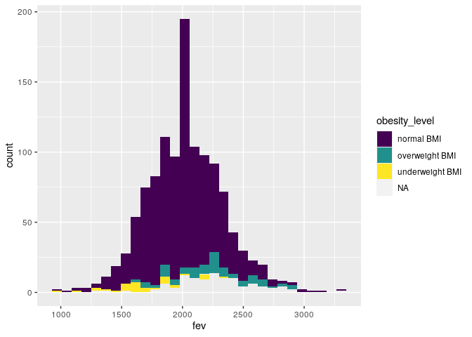
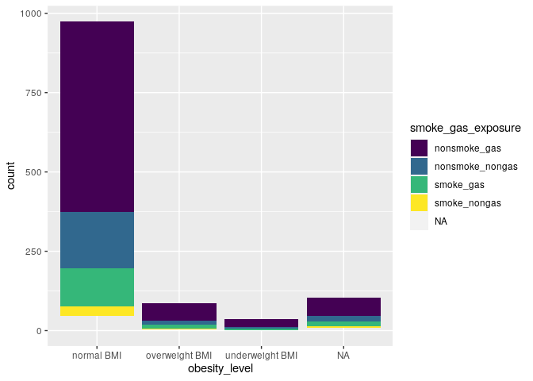

Assignment02
================

``` r
library(data.table)
library(tidyverse)
library(ggplot2)
library(leaflet)
library(gtsummary)
```

``` r
chs_individual <- data.table::fread("chs_individual.csv")
chs_regional <- data.table::fread("chs_regional.csv")

# merge two data frames by location
total <- merge(chs_individual, chs_regional,by="townname")
dim(total)
```

    ## [1] 1200   49

``` r
head(total)
```

    ##    townname sid male race hispanic    agepft height weight      bmi asthma
    ## 1:   Alpine 835    0    W        0 10.099932    143     69 15.33749      0
    ## 2:   Alpine 838    0    O        1  9.486653    133     62 15.93183      0
    ## 3:   Alpine 839    0    M        1 10.053388    142     86 19.38649      0
    ## 4:   Alpine 840    0    W        0  9.965777    146     78 16.63283      0
    ## 5:   Alpine 841    1    W        1 10.548939    150     78 15.75758      0
    ## 6:   Alpine 842    1    M        1  9.489391    139     65 15.29189      0
    ##    active_asthma father_asthma mother_asthma wheeze hayfever allergy
    ## 1:             0             0             0      0        0       1
    ## 2:             0             0             0      0        0       0
    ## 3:             0             0             1      1        1       1
    ## 4:             0             0             0      0        0       0
    ## 5:             0             0             0      0        0       0
    ## 6:             0             0             0      1        0       0
    ##    educ_parent smoke pets gasstove      fev      fvc     mmef pm25_mass
    ## 1:           3     0    1        0 2529.276 2826.316 3406.579      8.74
    ## 2:           4    NA    1        0 1737.793 1963.545 2133.110      8.74
    ## 3:           3     1    1        0 2121.711 2326.974 2835.197      8.74
    ## 4:          NA    NA    0       NA 2466.791 2638.221 3466.464      8.74
    ## 5:           5     0    1        0 2251.505 2594.649 2445.151      8.74
    ## 6:           1     1    1        0 2188.716 2423.934 2524.599      8.74
    ##    pm25_so4 pm25_no3 pm25_nh4 pm25_oc pm25_ec pm25_om pm10_oc pm10_ec pm10_tc
    ## 1:     1.73     1.59     0.88    2.54    0.48    3.04    3.25    0.49    3.75
    ## 2:     1.73     1.59     0.88    2.54    0.48    3.04    3.25    0.49    3.75
    ## 3:     1.73     1.59     0.88    2.54    0.48    3.04    3.25    0.49    3.75
    ## 4:     1.73     1.59     0.88    2.54    0.48    3.04    3.25    0.49    3.75
    ## 5:     1.73     1.59     0.88    2.54    0.48    3.04    3.25    0.49    3.75
    ## 6:     1.73     1.59     0.88    2.54    0.48    3.04    3.25    0.49    3.75
    ##    formic acetic  hcl hno3 o3_max o3106 o3_24   no2  pm10 no_24hr pm2_5_fr
    ## 1:   1.03   2.49 0.41 1.98  65.82 55.05 41.23 12.18 24.73    2.48    10.28
    ## 2:   1.03   2.49 0.41 1.98  65.82 55.05 41.23 12.18 24.73    2.48    10.28
    ## 3:   1.03   2.49 0.41 1.98  65.82 55.05 41.23 12.18 24.73    2.48    10.28
    ## 4:   1.03   2.49 0.41 1.98  65.82 55.05 41.23 12.18 24.73    2.48    10.28
    ## 5:   1.03   2.49 0.41 1.98  65.82 55.05 41.23 12.18 24.73    2.48    10.28
    ## 6:   1.03   2.49 0.41 1.98  65.82 55.05 41.23 12.18 24.73    2.48    10.28
    ##    iacid oacid total_acids       lon      lat
    ## 1:  2.39  3.52         5.5 -116.7664 32.83505
    ## 2:  2.39  3.52         5.5 -116.7664 32.83505
    ## 3:  2.39  3.52         5.5 -116.7664 32.83505
    ## 4:  2.39  3.52         5.5 -116.7664 32.83505
    ## 5:  2.39  3.52         5.5 -116.7664 32.83505
    ## 6:  2.39  3.52         5.5 -116.7664 32.83505

``` r
tail(total)
```

    ##    townname  sid male race hispanic    agepft height weight      bmi asthma
    ## 1:   Upland 1866    0    O        1  9.806982    139     60 14.11559      0
    ## 2:   Upland 1867    0    M        1  9.618070    140     71 16.46568      0
    ## 3:   Upland 2031    1    W        0  9.798768    135     83 20.70084      0
    ## 4:   Upland 2032    1    W        0  9.549624    137     59 14.28855      0
    ## 5:   Upland 2033    0    M        0 10.121834    130     67 18.02044      0
    ## 6:   Upland 2053    0    W        0        NA     NA     NA       NA      0
    ##    active_asthma father_asthma mother_asthma wheeze hayfever allergy
    ## 1:             0            NA             0      0       NA      NA
    ## 2:             0             1             0      0        0       0
    ## 3:             0             0             0      1        0       1
    ## 4:             0             0             1      1        1       1
    ## 5:             1             0             0      1        1       0
    ## 6:             0             0             0      0        0       0
    ##    educ_parent smoke pets gasstove      fev      fvc     mmef pm25_mass
    ## 1:           3     0    1        0 1691.275 1928.859 1890.604     22.46
    ## 2:           3     0    1        0 1733.338 1993.040 2072.643     22.46
    ## 3:           3     0    1        1 2034.177 2505.535 1814.075     22.46
    ## 4:           3     0    1        1 2077.703 2275.338 2706.081     22.46
    ## 5:           3     0    1        1 1929.866 2122.148 2558.054     22.46
    ## 6:           3     0    1        0       NA       NA       NA     22.46
    ##    pm25_so4 pm25_no3 pm25_nh4 pm25_oc pm25_ec pm25_om pm10_oc pm10_ec pm10_tc
    ## 1:     2.65     7.75     2.96    6.49    1.19    7.79    8.32    1.22    9.54
    ## 2:     2.65     7.75     2.96    6.49    1.19    7.79    8.32    1.22    9.54
    ## 3:     2.65     7.75     2.96    6.49    1.19    7.79    8.32    1.22    9.54
    ## 4:     2.65     7.75     2.96    6.49    1.19    7.79    8.32    1.22    9.54
    ## 5:     2.65     7.75     2.96    6.49    1.19    7.79    8.32    1.22    9.54
    ## 6:     2.65     7.75     2.96    6.49    1.19    7.79    8.32    1.22    9.54
    ##    formic acetic  hcl hno3 o3_max o3106 o3_24   no2 pm10 no_24hr pm2_5_fr iacid
    ## 1:   2.67   4.73 0.46 4.03  63.83  46.5  22.2 37.97 40.8   18.48    27.73  4.49
    ## 2:   2.67   4.73 0.46 4.03  63.83  46.5  22.2 37.97 40.8   18.48    27.73  4.49
    ## 3:   2.67   4.73 0.46 4.03  63.83  46.5  22.2 37.97 40.8   18.48    27.73  4.49
    ## 4:   2.67   4.73 0.46 4.03  63.83  46.5  22.2 37.97 40.8   18.48    27.73  4.49
    ## 5:   2.67   4.73 0.46 4.03  63.83  46.5  22.2 37.97 40.8   18.48    27.73  4.49
    ## 6:   2.67   4.73 0.46 4.03  63.83  46.5  22.2 37.97 40.8   18.48    27.73  4.49
    ##    oacid total_acids       lon      lat
    ## 1:   7.4       11.43 -117.6484 34.09751
    ## 2:   7.4       11.43 -117.6484 34.09751
    ## 3:   7.4       11.43 -117.6484 34.09751
    ## 4:   7.4       11.43 -117.6484 34.09751
    ## 5:   7.4       11.43 -117.6484 34.09751
    ## 6:   7.4       11.43 -117.6484 34.09751

``` r
str(total)
```

    ## Classes 'data.table' and 'data.frame':   1200 obs. of  49 variables:
    ##  $ townname     : chr  "Alpine" "Alpine" "Alpine" "Alpine" ...
    ##  $ sid          : int  835 838 839 840 841 842 843 844 847 849 ...
    ##  $ male         : int  0 0 0 0 1 1 1 1 1 1 ...
    ##  $ race         : chr  "W" "O" "M" "W" ...
    ##  $ hispanic     : int  0 1 1 0 1 1 0 1 0 0 ...
    ##  $ agepft       : num  10.1 9.49 10.05 9.97 10.55 ...
    ##  $ height       : int  143 133 142 146 150 139 149 143 137 147 ...
    ##  $ weight       : int  69 62 86 78 78 65 98 65 69 112 ...
    ##  $ bmi          : num  15.3 15.9 19.4 16.6 15.8 ...
    ##  $ asthma       : int  0 0 0 0 0 0 0 NA 0 0 ...
    ##  $ active_asthma: int  0 0 0 0 0 0 0 0 0 0 ...
    ##  $ father_asthma: int  0 0 0 0 0 0 0 NA 0 1 ...
    ##  $ mother_asthma: int  0 0 1 0 0 0 0 NA 0 0 ...
    ##  $ wheeze       : int  0 0 1 0 0 1 1 NA 0 1 ...
    ##  $ hayfever     : int  0 0 1 0 0 0 0 NA 0 0 ...
    ##  $ allergy      : int  1 0 1 0 0 0 1 NA 0 1 ...
    ##  $ educ_parent  : int  3 4 3 NA 5 1 3 NA 5 3 ...
    ##  $ smoke        : int  0 NA 1 NA 0 1 0 NA 0 0 ...
    ##  $ pets         : int  1 1 1 0 1 1 1 0 1 1 ...
    ##  $ gasstove     : int  0 0 0 NA 0 0 1 NA 1 0 ...
    ##  $ fev          : num  2529 1738 2122 2467 2252 ...
    ##  $ fvc          : num  2826 1964 2327 2638 2595 ...
    ##  $ mmef         : num  3407 2133 2835 3466 2445 ...
    ##  $ pm25_mass    : num  8.74 8.74 8.74 8.74 8.74 8.74 8.74 8.74 8.74 8.74 ...
    ##  $ pm25_so4     : num  1.73 1.73 1.73 1.73 1.73 1.73 1.73 1.73 1.73 1.73 ...
    ##  $ pm25_no3     : num  1.59 1.59 1.59 1.59 1.59 1.59 1.59 1.59 1.59 1.59 ...
    ##  $ pm25_nh4     : num  0.88 0.88 0.88 0.88 0.88 0.88 0.88 0.88 0.88 0.88 ...
    ##  $ pm25_oc      : num  2.54 2.54 2.54 2.54 2.54 2.54 2.54 2.54 2.54 2.54 ...
    ##  $ pm25_ec      : num  0.48 0.48 0.48 0.48 0.48 0.48 0.48 0.48 0.48 0.48 ...
    ##  $ pm25_om      : num  3.04 3.04 3.04 3.04 3.04 3.04 3.04 3.04 3.04 3.04 ...
    ##  $ pm10_oc      : num  3.25 3.25 3.25 3.25 3.25 3.25 3.25 3.25 3.25 3.25 ...
    ##  $ pm10_ec      : num  0.49 0.49 0.49 0.49 0.49 0.49 0.49 0.49 0.49 0.49 ...
    ##  $ pm10_tc      : num  3.75 3.75 3.75 3.75 3.75 3.75 3.75 3.75 3.75 3.75 ...
    ##  $ formic       : num  1.03 1.03 1.03 1.03 1.03 1.03 1.03 1.03 1.03 1.03 ...
    ##  $ acetic       : num  2.49 2.49 2.49 2.49 2.49 2.49 2.49 2.49 2.49 2.49 ...
    ##  $ hcl          : num  0.41 0.41 0.41 0.41 0.41 0.41 0.41 0.41 0.41 0.41 ...
    ##  $ hno3         : num  1.98 1.98 1.98 1.98 1.98 1.98 1.98 1.98 1.98 1.98 ...
    ##  $ o3_max       : num  65.8 65.8 65.8 65.8 65.8 ...
    ##  $ o3106        : num  55 55 55 55 55 ...
    ##  $ o3_24        : num  41.2 41.2 41.2 41.2 41.2 ...
    ##  $ no2          : num  12.2 12.2 12.2 12.2 12.2 ...
    ##  $ pm10         : num  24.7 24.7 24.7 24.7 24.7 ...
    ##  $ no_24hr      : num  2.48 2.48 2.48 2.48 2.48 2.48 2.48 2.48 2.48 2.48 ...
    ##  $ pm2_5_fr     : num  10.3 10.3 10.3 10.3 10.3 ...
    ##  $ iacid        : num  2.39 2.39 2.39 2.39 2.39 2.39 2.39 2.39 2.39 2.39 ...
    ##  $ oacid        : num  3.52 3.52 3.52 3.52 3.52 3.52 3.52 3.52 3.52 3.52 ...
    ##  $ total_acids  : num  5.5 5.5 5.5 5.5 5.5 5.5 5.5 5.5 5.5 5.5 ...
    ##  $ lon          : num  -117 -117 -117 -117 -117 ...
    ##  $ lat          : num  32.8 32.8 32.8 32.8 32.8 ...
    ##  - attr(*, ".internal.selfref")=<externalptr> 
    ##  - attr(*, "sorted")= chr "townname"

``` r
nrow(chs_individual)
```

    ## [1] 1200

``` r
nrow(chs_regional)
```

    ## [1] 12

``` r
nrow(total)
```

    ## [1] 1200

``` r
total1 <- total                                              
for(i in 1:ncol(total)) {                                   
  total1[[i]][is.na(total1[[i]])] <- mean(total1[[i]], na.rm = TRUE)
}
```

    ## Warning in mean.default(total1[[i]], na.rm = TRUE): argument is not numeric or
    ## logical: returning NA

    ## Warning in mean.default(total1[[i]], na.rm = TRUE): argument is not numeric or
    ## logical: returning NA

``` r
total1                                                     
```

    ##       townname  sid male race hispanic    agepft   height   weight      bmi
    ##    1:   Alpine  835    0    W        0 10.099932 143.0000 69.00000 15.33749
    ##    2:   Alpine  838    0    O        1  9.486653 133.0000 62.00000 15.93183
    ##    3:   Alpine  839    0    M        1 10.053388 142.0000 86.00000 19.38649
    ##    4:   Alpine  840    0    W        0  9.965777 146.0000 78.00000 16.63283
    ##    5:   Alpine  841    1    W        1 10.548939 150.0000 78.00000 15.75758
    ##   ---                                                                      
    ## 1196:   Upland 1867    0    M        1  9.618070 140.0000 71.00000 16.46568
    ## 1197:   Upland 2031    1    W        0  9.798768 135.0000 83.00000 20.70084
    ## 1198:   Upland 2032    1    W        0  9.549624 137.0000 59.00000 14.28855
    ## 1199:   Upland 2033    0    M        0 10.121834 130.0000 67.00000 18.02044
    ## 1200:   Upland 2053    0    W        0  9.923704 138.9595 79.33123 18.50483
    ##       asthma active_asthma father_asthma mother_asthma wheeze hayfever allergy
    ##    1:      0             0             0             0      0        0       1
    ##    2:      0             0             0             0      0        0       0
    ##    3:      0             0             0             1      1        1       1
    ##    4:      0             0             0             0      0        0       0
    ##    5:      0             0             0             0      0        0       0
    ##   ---                                                                         
    ## 1196:      0             0             1             0      0        0       0
    ## 1197:      0             0             0             0      1        0       1
    ## 1198:      0             0             0             1      1        1       1
    ## 1199:      0             1             0             0      1        1       0
    ## 1200:      0             0             0             0      0        0       0
    ##       educ_parent     smoke pets gasstove      fev      fvc     mmef pm25_mass
    ##    1:    3.000000 0.0000000    1 0.000000 2529.276 2826.316 3406.579      8.74
    ##    2:    4.000000 0.1637931    1 0.000000 1737.793 1963.545 2133.110      8.74
    ##    3:    3.000000 1.0000000    1 0.000000 2121.711 2326.974 2835.197      8.74
    ##    4:    2.796655 0.1637931    0 0.781491 2466.791 2638.221 3466.464      8.74
    ##    5:    5.000000 0.0000000    1 0.000000 2251.505 2594.649 2445.151      8.74
    ##   ---                                                                         
    ## 1196:    3.000000 0.0000000    1 0.000000 1733.338 1993.040 2072.643     22.46
    ## 1197:    3.000000 0.0000000    1 1.000000 2034.177 2505.535 1814.075     22.46
    ## 1198:    3.000000 0.0000000    1 1.000000 2077.703 2275.338 2706.081     22.46
    ## 1199:    3.000000 0.0000000    1 1.000000 1929.866 2122.148 2558.054     22.46
    ## 1200:    3.000000 0.0000000    1 0.000000 2031.265 2323.915 2398.768     22.46
    ##       pm25_so4 pm25_no3 pm25_nh4 pm25_oc pm25_ec pm25_om pm10_oc pm10_ec
    ##    1:     1.73     1.59     0.88    2.54    0.48    3.04    3.25    0.49
    ##    2:     1.73     1.59     0.88    2.54    0.48    3.04    3.25    0.49
    ##    3:     1.73     1.59     0.88    2.54    0.48    3.04    3.25    0.49
    ##    4:     1.73     1.59     0.88    2.54    0.48    3.04    3.25    0.49
    ##    5:     1.73     1.59     0.88    2.54    0.48    3.04    3.25    0.49
    ##   ---                                                                   
    ## 1196:     2.65     7.75     2.96    6.49    1.19    7.79    8.32    1.22
    ## 1197:     2.65     7.75     2.96    6.49    1.19    7.79    8.32    1.22
    ## 1198:     2.65     7.75     2.96    6.49    1.19    7.79    8.32    1.22
    ## 1199:     2.65     7.75     2.96    6.49    1.19    7.79    8.32    1.22
    ## 1200:     2.65     7.75     2.96    6.49    1.19    7.79    8.32    1.22
    ##       pm10_tc formic acetic  hcl hno3 o3_max o3106 o3_24   no2  pm10 no_24hr
    ##    1:    3.75   1.03   2.49 0.41 1.98  65.82 55.05 41.23 12.18 24.73    2.48
    ##    2:    3.75   1.03   2.49 0.41 1.98  65.82 55.05 41.23 12.18 24.73    2.48
    ##    3:    3.75   1.03   2.49 0.41 1.98  65.82 55.05 41.23 12.18 24.73    2.48
    ##    4:    3.75   1.03   2.49 0.41 1.98  65.82 55.05 41.23 12.18 24.73    2.48
    ##    5:    3.75   1.03   2.49 0.41 1.98  65.82 55.05 41.23 12.18 24.73    2.48
    ##   ---                                                                       
    ## 1196:    9.54   2.67   4.73 0.46 4.03  63.83 46.50 22.20 37.97 40.80   18.48
    ## 1197:    9.54   2.67   4.73 0.46 4.03  63.83 46.50 22.20 37.97 40.80   18.48
    ## 1198:    9.54   2.67   4.73 0.46 4.03  63.83 46.50 22.20 37.97 40.80   18.48
    ## 1199:    9.54   2.67   4.73 0.46 4.03  63.83 46.50 22.20 37.97 40.80   18.48
    ## 1200:    9.54   2.67   4.73 0.46 4.03  63.83 46.50 22.20 37.97 40.80   18.48
    ##       pm2_5_fr iacid oacid total_acids       lon      lat
    ##    1:    10.28  2.39  3.52        5.50 -116.7664 32.83505
    ##    2:    10.28  2.39  3.52        5.50 -116.7664 32.83505
    ##    3:    10.28  2.39  3.52        5.50 -116.7664 32.83505
    ##    4:    10.28  2.39  3.52        5.50 -116.7664 32.83505
    ##    5:    10.28  2.39  3.52        5.50 -116.7664 32.83505
    ##   ---                                                    
    ## 1196:    27.73  4.49  7.40       11.43 -117.6484 34.09751
    ## 1197:    27.73  4.49  7.40       11.43 -117.6484 34.09751
    ## 1198:    27.73  4.49  7.40       11.43 -117.6484 34.09751
    ## 1199:    27.73  4.49  7.40       11.43 -117.6484 34.09751
    ## 1200:    27.73  4.49  7.40       11.43 -117.6484 34.09751

``` r
total1<-data.table(total1)
total1[, obesity_level := fifelse(bmi < 14, "underweight BMI", NA_character_)]
total1[is.na(obesity_level), obesity_level := fifelse(bmi<22, "normal BMI", NA_character_)]
total1[is.na(obesity_level), obesity_level := fifelse(bmi<24, "overweight BMI", NA_character_)]
total1[is.na(obesity_level), obesity_level := fifelse(bmi<24, "obese BMI", NA_character_)]

total1[, .(min = min(bmi), max = max(bmi), n = .N), by = obesity_level]
```

    ##      obesity_level      min      max   n
    ## 1:      normal BMI 14.00380 21.96387 975
    ## 2:  overweight BMI 22.02353 23.99650  87
    ## 3:            <NA> 24.00647 41.26613 103
    ## 4: underweight BMI 11.29640 13.98601  35

``` r
total1[, smoke_gas_exposure := fifelse(smoke==1 & gasstove==1, "smoke_gas", NA_character_)]
total1[is.na(smoke_gas_exposure), smoke_gas_exposure := fifelse(smoke==1 & gasstove==0, "smoke_nongas", NA_character_)]
total1[is.na(smoke_gas_exposure), smoke_gas_exposure := fifelse(smoke==0 & gasstove==1, "nonsmoke_gas", NA_character_)]
total1[is.na(smoke_gas_exposure), smoke_gas_exposure := fifelse(smoke==0 & gasstove==0, "nonsmoke_nongas", NA_character_)]

total1[, table(smoke_gas_exposure)]
```

    ## smoke_gas_exposure
    ##    nonsmoke_gas nonsmoke_nongas       smoke_gas    smoke_nongas 
    ##             739             214             151              36

``` r
total1[, .(
  "Mean fev"    = mean(fev, na.rm = TRUE),
  "Sd fev"      = sd(fev, na.rm = TRUE),
  "Prop Asthma" = mean(asthma, na.rm = TRUE),
  "Sd Asthma"   = sd(asthma, na.rm = TRUE)
  ),
  by = townname]
```

    ##          townname Mean fev   Sd fev Prop Asthma Sd Asthma
    ##  1:        Alpine 2086.126 290.8511   0.1143884 0.3139150
    ##  2:    Atascadero 2076.968 323.5605   0.2529256 0.4339816
    ##  3: Lake Elsinore 2039.020 302.8403   0.1273139 0.3254539
    ##  4:  Lake Gregory 2085.021 319.0736   0.1514628 0.3585507
    ##  5:     Lancaster 2005.996 316.1541   0.1643884 0.3673800
    ##  6:        Lompoc 2037.600 350.3531   0.1143884 0.3139150
    ##  7:    Long Beach 1987.212 318.9554   0.1358512 0.3369506
    ##  8:     Mira Loma 1987.984 324.7413   0.1573139 0.3572089
    ##  9:     Riverside 1990.267 276.5614   0.1100000 0.3144660
    ## 10:     San Dimas 2027.875 318.7055   0.1714628 0.3771430
    ## 11:   Santa Maria 2023.511 311.1821   0.1343884 0.3372223
    ## 12:        Upland 2027.603 342.4664   0.1214628 0.3263833

``` r
# You figure out the rest
```

``` r
ggplot(data = total1, mapping = aes(x = bmi, y = fev, fill = townname)) +
  geom_point() + geom_smooth(method = "lm", se = FALSE) +
  labs(title = "BMI vs FEV", xlab  = "BMI", y = "FEV")
```

    ## `geom_smooth()` using formula 'y ~ x'

<!-- -->

``` r
ggplot(total1) + 
  # Setting the fill color argument to be viridis discrete
  scale_fill_viridis_d() +
  geom_histogram(mapping = aes(x = fev, fill=obesity_level))
```

    ## `stat_bin()` using `bins = 30`. Pick better value with `binwidth`.

<!-- -->

``` r
# You figure out the other
# ggplot(total1) + 
#   geom_histogram(mapping = aes(x = fev, fill=smoke_gas_exposure, col=blue))
```

``` r
ggplot(total1) + 
  geom_bar(mapping = aes(x = obesity_level, fill = smoke_gas_exposure))+
  scale_fill_viridis_d()
```

<!-- -->

``` r
ggplot(total1) + 
    stat_summary(mapping = aes(x = fev, y = obesity_level),
    fun.min = min,
    fun.max = max,
    fun = median)
```

<!-- -->

``` r
# l <- total1[!is.na(fev) & fev != "clear"] %>%
#   ggplot() + 
#     stat_summary(mapping = aes(x = fev, y = smoke_gas_exposure),
#     fun.min = min,
#     fun.max = max,
#     fun = median)
```

``` r
total2 <- unique(total1[,.(townname, lon, lat, pm25_mass)])

pal <- colorNumeric(c("green", "yellow", "red"), domain = range(total2$pm25_mass))

leaflet(total2) %>% 
  addTiles() %>% 
  addCircles(
    lat = ~lat, lng = ~lon, opacity = 1, fillOpacity = .5,
    radius = ~pm25_mass*500,
    stroke = 2,
    color     = ~ pal(pm25_mass),
    fillColor = ~ pal(pm25_mass)) %>%
  addLegend(pal = pal, values = ~pm25_mass, title = "PM2.5 Mass")
```

``` r
mod <- lm(fev ~ pm25_mass, data = total1)
total1[, plot(
  pm25_mass, fev, pch=19, cex=0.5, 
  main = "FEV and PM2.5 mass", 
  xlab = "PM2.5 mass", ylab = "FEV")
  ]
```

    ## NULL

``` r
abline(mod, lwd=2, col="red")
```

<!-- -->
